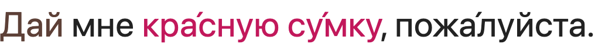
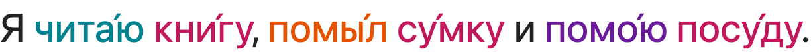

# duolingo-russian

A userscript that annotates the **Russian** course on Duolingo's web app:

- **Gender** — nouns & adjectives coloured 🔵 masculine · 🔴 feminine · 🟢 neuter
- **Verb tense/mood** — verbs coloured 🟠 past · teal present · 🟣 future · brown imperative · slate infinitive
- **Stress (ударение)** — a combining acute on the stressed vowel of every word (`пожа́луйста`, `ведро́`)

Function words (particles, pronouns) are left alone. All three work on **inflected** forms (e.g. `су́мку`, `кра́сную`) because the data is a full wordform dictionary, not an ending guess.

> Formerly **gender-reveal** → **declension-highlighter**. Rewritten in 2026 for Russian — the original scraped Duolingo's old hover-hints, which no longer carry this info.

## Screenshots

<!-- Drop PNGs into images/ and reference them here. (Goal: auto-generate these from a
     visual test that renders the captured fixtures + the userscript.) -->

| Gender + stress | Verb tense |
|---|---|
|  |  |

## Install

With [Tampermonkey](https://www.tampermonkey.net/) or [Violentmonkey](https://violentmonkey.github.io/) installed, click:

### → [Install the userscript](https://github.com/jimdc/duolingo-russian/raw/master/dist/duolingo-russian.user.js)

Confirm the one cross-origin permission (`raw.githubusercontent.com`, used to fetch the dictionaries), then open a Russian lesson on duolingo.com. It self-updates via `@updateURL`.

> **Chrome gotcha (2024+):** Chrome won't run userscripts until you allow them. Go to `chrome://extensions`, toggle **Developer mode** on (top-right), open Tampermonkey's **Details**, and enable **Allow User Scripts**. Otherwise the script installs but never runs.

### About the dictionary download

On first run the script downloads ~18 MB of OpenRussian wordform data (gender / stress / verb-tense), showing progress in the on-page legend, then caches it in **IndexedDB**. After that it loads instantly and works offline — it's a one-time download, not per page.

## How it works

Duolingo doesn't expose gender/stress/tense, so we annotate from a local dictionary:

1. Read the prompt words from `[data-test="hint-token"]` aria-labels and group the per-character spans into words.
2. Look each word up in a wordform → {gender, stress, tense} lexicon built from [OpenRussian](https://github.com/Badestrand/russian-dictionary). Because every declension/conjugation cell is included, inflected forms resolve and non-nouns simply aren't found (so they're left uncoloured).
3. Add a gender/tense colour class to the word's Cyrillic letters, and append a combining acute to the stressed vowel.

The core in `src/` is dependency-free and packaging-agnostic; `scripts/build-userscript.mjs` bundles it into the userscript (and could emit an MV3 extension later).

## Develop

```sh
npm install
npm test            # node --test — 29 tests, incl. real captured-DOM fixtures
npm run build       # bundle src/ → dist/duolingo-russian.user.js
node scripts/build-lexicon.mjs   # rebuild gender data from data/*.csv (gitignored)
node scripts/build-stress.mjs    # rebuild stress data
node scripts/build-verbs.mjs     # rebuild verb-tense data
```

| Path | What |
|---|---|
| `src/ru-gender.js` | `normalize()` + a fallback ending heuristic |
| `src/lexicon.js` · `src/stress.js` · `src/verbs.js` | gender / stress / tense lookups |
| `src/colorize.js` | shared `wordGroups()` + gender colouring |
| `src/data/*.json` | the shipped lexicons (built from OpenRussian) |
| `tests/fixtures/` | real Duolingo Russian challenge captures |
| `scripts/build-*.mjs` | lexicon builders + userscript bundler |

## Testing

```sh
npm test          # headless unit tests (node --test, 29)
npm run visual    # render sample sentences in real Chrome → images/*.png (the README shots)
```

`npm run visual` drives your **system Chrome** (no browser download) via `playwright-core`, renders Duolingo-shaped prompt DOM through the real annotation modules, screenshots each to `images/`, and fails if nothing rendered.

**Live spot-check on real lessons** (Tier 2) — quit Chrome, relaunch with remote debugging (keeps your login + Tampermonkey), open a lesson, then capture it:

```sh
/Applications/Google\ Chrome.app/Contents/MacOS/Google\ Chrome --remote-debugging-port=9222
npm run visual:live   # connects over CDP → images/live-lesson.png
```

## Roadmap

- Resolve homograph collisions (e.g. `мою` = "I wash" vs "my") — currently gender wins
- Case / declension hints; ё vs е restoration
- Colour Russian word-bank tiles in EN→RU exercises
- Optional MV3 extension build

## License

MIT (code) — see [LICENSE](LICENSE). Bundled language data is derived from **OpenRussian** and is **CC-BY-SA 4.0** (attribution + share-alike).
